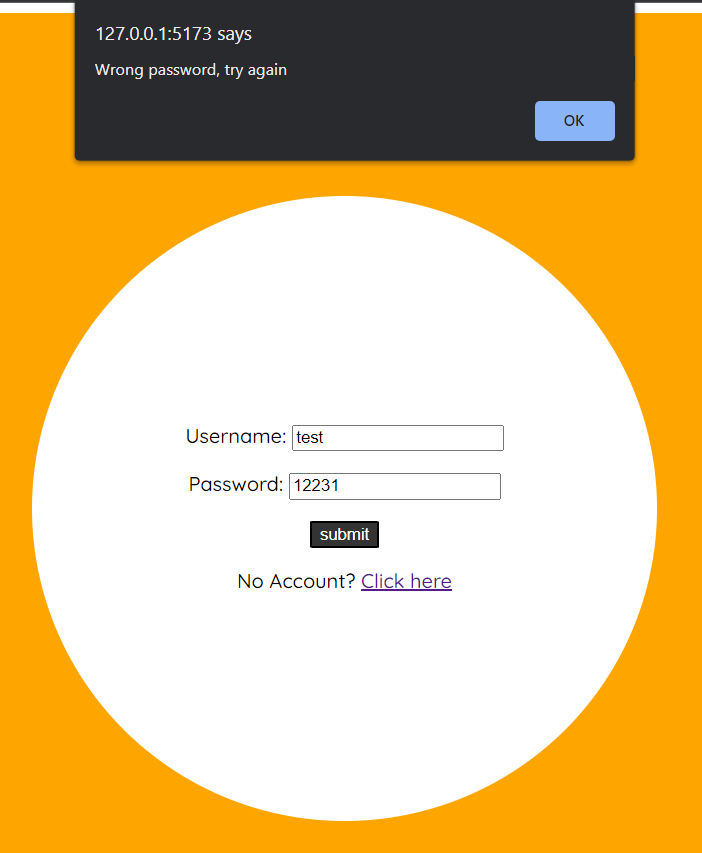
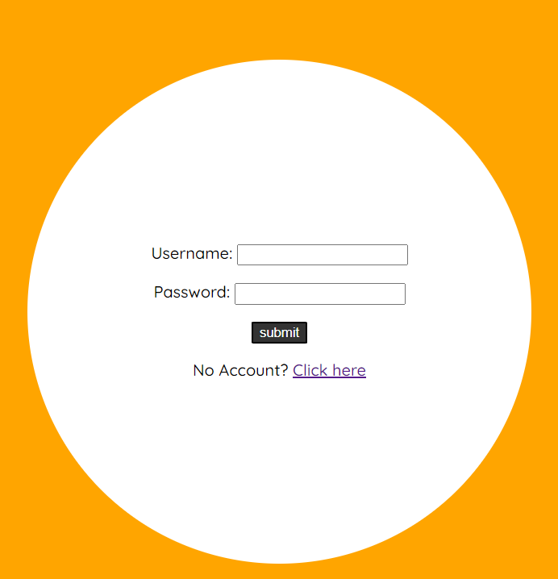

## Per executar:
- Obre terminal i navega a les carpetes [`server`] i [`client`]
- S'ha de fer [`npm install`] dins d'ambdues carpetes
- Dins les carpetes server i client crea un document `.env` amb els elements definits al document `.env-template` que trobarás a cada carpeta.
- Per iniciar el servidor executa el backend i front end 
    - Backend: dintre la carpeta server: [`npm start`]
    - Frontend: dintre la carpeta client: [`npm start`]

## Endpoints
El `frontend` te un total de 3 endpoints:
- **Login:** Encarregat de fer login als usuaris ja existents.
    - El usuari, ja creat, fa servir el seu nom d'usuari i contrasenya per entrar.
- **Singup:** Encarregat de registrar els nous usuaris.
    - El nou usuari pot registrar el seu usuari i contrasenya desitjats i el nickname, nom amb el qual s'enviaran els missatges.
- **Chat:** Encarregat de creació de sales i gestió de missatges i usuaris conectats.
    - Aquí el usuari podrà crear i eliminar sales, enviar missatges i veure als usuaris registrats en cada sala.

El `backend` disposa de 2 endpoints:
- **Chat:** Encarregat d'actualitzar la llista de missatges i usuaris conectats en cada canal.
- **User:** Encarregat de registrar als usuaris, encriptar les contrasenyes i gestionar les sales creades.

## Sockets
Sockets en `backend`:
- **login:** Actualitza el array d'usuaris conectats i emet un missatge informant que un usuari nou ha entrat a la sala.
- **showMessage:** Actualitza el array de missatges.
- **left:** Actualitza el array d'usuaris conectats i emet un missatge informant que ha marxat de la sala.
- **joined:** Variació del socket login adaptat a usuaris que ja estaven conectats pero que s'han unit a una sala nova. Actualitza el array d'usuaris i informa que ha entrat a la sala.

Sockets en `backend`:
- **new-user:** Registra les noves entrades al xat i emet el socket `login` al frontend.
- **sendMessage:** Registra els nous missatges i emet el socket `showMessage` al frontend.
- **leaveRoom:** Registra sortides de sala i emet el socket `left` al frontend.
- **joinRoom:** Registra entrades de sala i emet el socket `joined` al frontend.
- **disconnect:** Registra la desconexió del usuari.

## Funcionalitats
- Funcionalitats en `Login`

